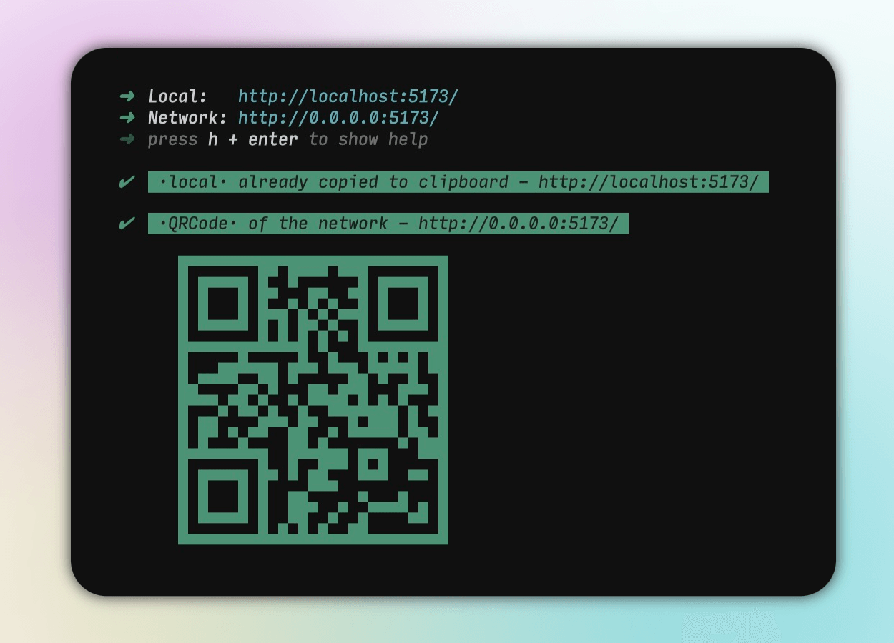

<h1 align="center">
vite-plugin-url-copy
</h1>

<p align="center">
<a href="https://github.com/XioDone/vite-plugin-url-copy" target="_blank"></a>
<a href="https://www.npmjs.com/package/vite-plugin-url-copy" target="_blank"></a>
</p>

<p align="center">⚡️ Auto copy the Vite server URL and generate a QR code for easy access during dev or preview.</p>

<p align="center"></p>

##### Features

- 🌟 Ready to use, supports dev and preview mode.
- 💭 Supports copy server URL (local and network types).
- 📱 Supports generate network URL QR code.
- 💡 Customizable characters for copy or generate QR code.
- 😃 Friendly Hot Reload, When the vite server performs a hot restart, the plugin will be reloaded again only after the plugin's configuration or port has changed.

> [!IMPORTANT]
> Recommended minimum vite version is v4.
>
> Vite CJS Node API deprecated: the CJS build of Vite's Node API is deprecated. See https://vitejs.dev/guide/troubleshooting.html#vite-cjs-node-api-deprecated for more details.
>
> We recommend configuring ESM as the default, and we will deprecate the CJS build in v2.

## Install

```bash
pnpm i vite-plugin-url-copy -D
```

## Usage

- Configure ESM as default in `package.json`, it's up to you

```json
{
  "type": "module"
}
```

- Add plugin to your `vite.config.ts`

```ts
import ServerUrlCopy from 'vite-plugin-url-copy'

export default defineConfig({
  plugins: [ServerUrlCopy()],
  server: {
    host: true,
  },
  preview: {
    host: true,
  },
})
```

#### !!! QR code is disabled by default and needs to be explicitly enabled

```ts
ServerUrlCopy({
  // QR code using network URL
  qrcode: {
    disabled: false,
  },
})
```

- Run

```bash
pnpm dev

#or

pnpm preview
```

## Configuration

```ts
ServerUrlCopy({
  copy: {
    // 'local' | 'network', default 'local'
    mode: 'local',
    // Custom any string to copy when the server start, It will overwrite the server URL
    custom: '',
    // Disable Copy, default false
    disabled: false,
  },
  qrcode: {
    // Custom any string for the generate network QR code, It will overwrite the server URL
    custom: '',
    // Disable QRCode, default true
    disabled: true,
  },
  // Disable plugin, default false
  disabled: false,
  // Log config info, default false
  debug: false,
})
```

Network may need to enable host

```js
// package.json
{
  "scripts": {
    "dev": "vite --host"
  }
}

// or vite.config.ts
export default defineConfig({
  plugins: [ServerUrlCopy()],
  server: {
    host: true,
  },
})
```

## Ending

Hey there! If you enjoy my project, please give me a ⭐️. It means a lot to me! Thanks! 😊

## License

[MIT](./LICENSE) License © 2023 [XioDone](https://github.com/XioDone)
